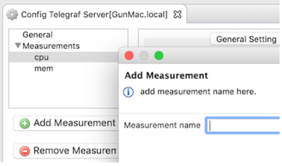
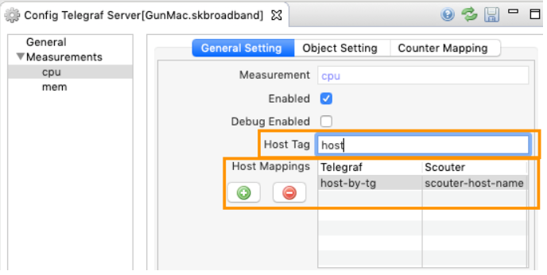
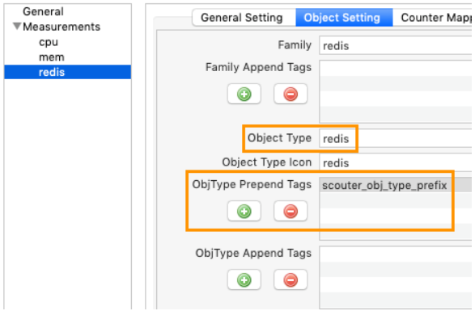

# Scouter

[toc]

## Scouter Server Docker설치

Git에서 Source 및 Dockerfile 가져오기

```bash
git clone https://github.com/GeunSam2/scouter-server-docker
```

Docker build

```bash
docker build -t geunsam2/scouter-server:1 .
```

Docker run

```bash
docker run -d \
-p 6100:6100 -p 6100:6100/UDP \
-p 6180:6180 -p 6180:6180/UDP \
-p 6188:6188 -p 6188:6188/UDP \
-v /data/scouter-log:/scouter/logs \
geunsam2/scouter-server:1
```


## Scouter Client 다운로드

주소

```url
https://github.com/scouter-project/scouter/releases/download/v2.7.0/scouter.client.product-win32.win32.x86_64.zip
```


## Scouter Telegraf 연동

* Scouter-telefraf Server 기능을 사용하면, Telegraf에서 수집하여 전송한 데이터를 Scouter에서 통합관리가 가능하다.
* 현재는 Telegraf의 HTTP output과 연동이 가능하다.


### Telegraf Docker

#### 1. Telegraf Config 가져오기

```bash
docker run --rm telegraf telegraf config > telegraf.conf
```


#### 2. sample program들 올리기

redis 올리기 / 접속

```bash
docker run -it --rm -d -p 36379:6379 redis
```

```bash
docker run -it --rm redis redis-cli -h 192.168.0.246 -p 36379
```


 `nginx_status.conf`   생성

```json
server {
    listen 8090;
    location /nginx_status {
        stub_status;
        access_log off;
    }
}
```

nginx 실행

```
docker run -d --name=nginx \
      -p 8090:8090 -p 8080:80 \
      -v $PWD/nginx_status.conf:/etc/nginx/conf.d/nginx_status.conf:ro \
      nginx
```


#### 3. Telegraf config 설정하기

```
[agent]
  interval = "10s"
  flush_interval = "10s"
[[outputs.http]]
  url = "http://192.168.0.248:6180/telegraf/metric"
  timeout = "5s"
  method = "POST"
  data_format = "influx"
[[inputs.redis]]
  servers = ["tcp://192.168.0.246:36379"]
[[inputs.nginx]]
  urls = ["http://192.168.0.246:8090/nginx_status"]
```


#### 4. Config 지정하여 Telegraf 실행하기

```bash
docker run -v $PWD/telegraf.conf:/etc/telegraf/telegraf.conf:ro telegraf
```


### Scouter Telegraf Server 기능 적용

#### 1. Scouter의 telegraf Server 옵션 활성화

먼저 Scouter Client 화면에서 Collector server의 http server 옵션을 활성화 한다.

- 메뉴 : Collector > Configures > Configure
  - `net_http_server_enabled=true`

만약 http port를 변경하고 싶다면 `net_http_port=xxx` 로 설정한다. 기본값은 6180 이다. 위 옵션들을 변경하였다면 Collector를 재시작하여야 한다.

그 다음으로 Telegraf 설정을 활성화 한다.

- 메뉴 : Colellector > Configures > Telegraf > Telegraf Configure
  - General 트리에서 `Enabled`를 체크하여 Telegraf Server 기능을 활성화 한다.

만약 요청되는 데이타의 확인이 필요한 경우 `Debug Enabled`를 체크하면 요청되는 모든 데이타를 로깅한다.


#### 2. Telegraf Http output을 통해 scouter로 데이터 전송

Telegraf http output의 end point를 scouter server로 지정, Scouter Server는 2초마다 요청을 처리하고 활용하는 점을 감안하며, telegraf 간격도 2~10초 로 설정하는 것이 적당하다.

```yaml
[[outputs.http]]
  url = "http://my-scouter-server:6180/telegraf/metric"
  timeout = "5s"
  method = "POST"
  data_format = "influx"
[agent]
  interval = "4s"
  flush_interval = "4s"
```

#### 3. Scouter Collector에 counter mapping 설정

telegraf에서 전달되는 measurement의 field를 scouter counter에 mapping 해야한다. 몇 가지 작업이 필요한데, 요약하자면 아래와 같은 항목들을 설정하면 된다.

- measurement 등록
- Host Mapping 설정 (optional)
- object type 설정
- object name 설정
- line protocol의 각 field를 scouter의 counter에 매핑

설정은 scouter client의 telegraf configure 화면을 통해서 진행할 수 있으며 이어지는 내용을 참고한다. (또는 scouter-telegraf.xml 파일을 직접 수정할 수 있다.)


**measurement 등록**

 Scouter-telegraf 기능을 처음 사용하는 경우라면 debug 옵션을 활성화한 후 요청이 들어오는 로그를 보면서 작업하는 것이 좋다. 로그에 표시되는 line protocol의 measurement 중 scouter에 저장하여 모니터링 하기를 원하는 measurement를 등록한다.



**Host Mapping 설정**

보통 여러대의 장비에서 성능 정보를 전송하므로 이를 구분하기 위한 Host 정보는 필수이다. 일반적으로 이 설정을 변경할 필요는 없으나 간혹 특정 line protocol이 host tag를 가지지 않을 수 있으니 이런 경우는 다음 내용을 참고하여 설정하도록 한다. line protocol의 `host` tag에 host name 정보가 전송되는데 만약 host 정보를 담고 있는 tag가 `host`가 아니라면 이를 변경할 수 있다. 그리고 전송된 host name이 scouter에서 설정된 host name과 다르다면 이에 대한 mapping도 설정할 수 있다. (보통은 동일하다.)



**Family 설정**

Family란 동일한 성능 모니터링 항목을 가지고 있는 집합을 지칭하는 이름이라고 생각하면 된다. 예를 들어 Host Family는 cpu, memory, disk io 등의 성능 정보를 가진다. 아래 예제에서는 Family를 redis로 설정한다. 이렇게 설정시, scouter에서 기본 제공되는 family와 이름 중복을 막기 위해 내부적으로는 X$redis 라는 이름으로 Family가 등록된다.

**Object type 설정**

object type은 scouter에서 한번에 모니터링하는 대상의 집합이다. 보통은 system 단위로 모니터링을 하므로 **특정 system에 존재하는 동일한 Family들**을 하나의 object type이라고 생각할 수 있다.예를 들어 주문 시스템의 여러 redis 인스턴스들은 한번에 모니터링되어야 하는 대상일 것이다. 이를 scouter에서는 **object type**이라고 한다. 따라서 이 redis 인스턴스들의 object type을 정한다면, `ORDER_SYSTEM_redis`와 같은 식으로 정할 수 있을 것이다. 여기서 앞에 붙는 ORDER_SYSTEM과 같은 prefix를 telegraf의 tag에 추가하고 scouter에서는 이를 조합하여 object type을 정하게 된다.
설정 예시는 아래 그림을 참고하도록 하자.



 telegraf에 tag를 추가할 수 있는 여러가지 방법이 있는데 가장 쉬운 방법은 global tag로 설정하는 방법이다. 또는 각 input 별로 tag를 추가하는 등 다양한 방식으로 설정이 가능하다. (보다 상세한 내용은 telegraf의 매뉴얼을 참고한다.)

```yaml
[global_tags]
  scouter_obj_type_prefix = "ORDER_SYSTEM"
```

 위 예제에서 설정된 값인 `scouter_obj_type_prefix`는 objtype_prepend_tag의 default value 이다. 만약 `scouter_obj_type_prefix` tag에 값이 없다면 redis measurement로 유입되는 모든 성능 메트릭의 object type은 그냥 **X$redis**이다. (기본 제공되는 object type과 중복 방지를 위해 `X$`는 scouter에서 자동으로 추가한다.) 따라서 시스템의 구분등이 없이 모든 redis를 하나의 type으로 관리하고 싶다면 이 설정은 무시해도 좋다. 

**Object name 설정**

 Scouter는 개별 모니터링 대상을 object라고 부른다. 여기서는 이 대상의 이름(`object_name`)을 설정한다. object_name의 full name은 내부적으로 `/{host-name}/object-name` 으로 등록되므로 host name이 다르다면 object name이 중복되어도 상관없다. 


위 그림에서 objName_append_tag를 `port`를 설정했는데 이는 하나의 host에 여러개의 redis가 존재하는 경우를 가정한 설정이다. (이렇게 설정하면 object name은 `redis_30779`, `redis_30789` 등이 될것이다.) telegraf를 통해 들어오는 입력값(line protocol)은 아래와 같은데

> redis,**host**=sc-api-demo-s01.localdomain,**port**=30779,**scouter_obj_type_prefix**=ORDER_SYSTEM,**server**=172-0-0-0.internal keyspace_hits=5507814i,expired_keys=1694047i,total_commands_processed=17575212i 1535289664000000000 

맨 앞의 `redis`는 **measurement**이고, 그 뒤에 나오는 `host`, `port`, `obj_type_prefix`, `server`는 **tag**이다. 이어 나오는 수치 정보는 line protocol 에서는 **field**라고 한다. 여기엔`keyspace_hits`, `expired_keys`, `total_commands_processed`라는 field가 존재한다. 위 설정으로 정해지는 object name은 결국 **redis_30779** 가 된다. 만약 objName_append_tag를 `server,port`로 설정한다면, object name은 **redis_172-0-0-0.internal_30779**가 된다. 

지금까지의 설정 결과를 종합하면 아래와 같다.

```bash
family = X$redis
object_type = X$ORDER_SYSTEM_redis
object_name = redis_30779
```

**Counter mapping 설정**

 마지막으로 line protocol의 field를 scouter의 counter로 설정한다. counter는 Family가 가질 수 있는 성능 정보이다. (이 예제에서는 X$redis라는 이름의 Family가 가질수 있는 성능 정보를 매핑하여 정의한다.)  여기서 설정되지 않은 field는 저장되지 않고 버려지는데, 당연히 모니터링 대상이 아닌 field는 telegraf client에서 버려지도록 처리하여 scouter로 전달되지 않도록 하는 것이 더 좋다.각 매핑 설정 항목은 다음과 같다. 

- Tg-field, **required**
  - line protocol에서 전달되는 telegraf field명이다.
- Counter, **required**
  - scouter에서의 counter 명이다.
  - **counter 명은 중복되어서는 안된다.**
- Delta Type, **required**
  - Delta counter는 초당 변경량을 보여주는 counter이다.
  - Delta counter로 지정되면 name에 **_$delta**가 추가되며 unit에는 **/s**가 추가된다..
  - Both로 지정하면 normal counter와 delta counter를 둘 다 가지게 된다.
- counter desc - optional, default : counter name
  - scouter에서 해당 counter를 화면에 표시할때 사용되는 값이다.
- unit - optional
  - 해당 값의 단위이다.
- totalizable - optional, default : true
  - 여러개의 값을 summarize하여 보여줄 수 있는지 여부이다.
  - 예를 들어 throughput은 true이고 memory 사용율은 false이다.(여러 VM의 memory 사용율을 sum하여 보여주면 이상하다.)
  - 이 값이 true인 경우 scouter의 화면에서 total 차트를 열 수 있다.
- nomalizing seconds
  - counter의 평균값을 구하는 time window의 크기이다.
  - default 0s, delta counter의 경우는 default 30s이다.


**Counter mapping - tag filter**

 전송되는 항목중에 특정한 tag 값을 가지는 경우만 수집할 수 있다. 예를 들어 4개의 cpu를 가진 VM의 cpu 정보를 수집하는데 이때 각 cpu별 사용량, 전체 cpu의 사용량이 모두 수집되고 이를 특정 tag값으로 구분할 수 있다. 만약 `cpu` tag의 값이 cpu-total, cpu-0인 경우만 수집하기를 원한다면 아래와 같이 설정한다.  만약 `cpu` tag의 값이 cpu-total만 제외하고 수집하고 싶다면 `!cpu-total` 이라고 설정한다. 


**scouter-telegaf.xml**

위 모든 설정은 Scouter client를 이용해 xml 설정 파일을 직접 수정할 수도 있다.

- 메뉴 : **Collector > Configures > Telegraf Config > Edit scouter-telegraf config file directly**

>  Scouter collector를 설치하면 ./conf 디렉토리에 scouter-telegraf.xml의 sample file이 있다. 이 sample file은 redis, nginx, mysql metric에 대한 예제를 포함하고 있다. 


#### 4. counters.site.xml 확인

위와 같이 설정한 후 telegraf 성능 정보가 scouter collector로 요청되면 해당 counter에 대한 메타정보가 counters.site.xml에 자동으로 등록된다. 단 설정에서 삭제한다고 해당 counter의 meta 정보가 삭제되지는 않는다. 이를 삭제하기 위해서는 counters.site.xml에서 직접 삭제하여야 하며 특히 화면에서 동일한 counter의 delta type등을 여러번 수정하다보면 동일한 Family에 같은 이름(`name`)을 가진 중복된 counter 정의가 존재할수 있으므로 이때는 counters.site.xml에서 이를 확인하고 적절히 수정하도록 한다.

- 메뉴 : Collectors > Config > Edit counters.site.xml

아래는 counters.site.xml을 간략화한 예시이다.

```xml
<Counters>
<Types>
    <ObjectType disp="SC-DEMO_java" family="javaee" icon="tomcat" name="SC-DEMO_java"/>
    <ObjectType disp="SC-DEMO_mysql" family="X$mysql" icon="mysql" name="SC-DEMO_mysql"/>
    <ObjectType disp="SC-DEMO_redis" family="X$redis" icon="redis" name="SC-DEMO_redis"/>
    <ObjectType disp="SC-DEMO_nginx" family="X$nginx" icon="nginx" name="SC-DEMO_nginx"/>
  </Types>

  <Familys>
    <Family name="X$mysql">
      <Counter disp="com_update_$delta" name="com_update_$delta" unit="/s"/>
      <Counter disp="connections" name="connections" unit=""/>
    </Family>
    <Family name="X$redis">
      <Counter disp="total_commands_processed" name="total_commands_processed" total="true" unit="ea"/>
      <Counter disp="total_commands_processed_$delta" name="total_commands_processed_$delta" unit="ea/s"/>
    </Family>
    <Family name="X$nginx">
      <Counter disp="active-conn-working" name="writing" total="true" unit="ea"/>
      <Counter disp="requests_$delta" name="request-count_$delta" total="true" unit="ea/s"/>
    </Family>
  </Familys>
</Counters>
```


#### 5. DCOS telegraf 설정

DCOS는 자체 telegraf 데몬을 가지고 있고, 아래 폴더에 `.conf`로 끝나는 설정파일을 작성하면 데몬이 시작될 때 해당 설정을 인식하여 매트릭을 보내준다.

```
/var/lib/dcos/telegraf/telegraf.d/
```

해당 폴더에 `scouter.conf`파일을 만든다. 설정은 위에서 작성한것과 같이 한다.

```yaml
[agent]
  interval = "4s"
  flush_interval = "4s"
  [[outputs.http]]
    url = "http://192.168.0.248:6180/telegraf/metric"
    timeout = "5s"
    method = "POST"
    data_format = "influx"
```

데몬을 재시작 해준다.

```bash
sudo systemctl restart dcos-telegraf
```


## Scouter Pager

다운로드 주소

```
https://github.com/scouter-contrib/scouter-paper/releases/download/2.6.3/scouter-paper-v2.6.3.zip
```


## Scouter에 Topology 보이기

sample program

```
git clone https://github.com/GeunSam2/scouter-java-agent-program
```

